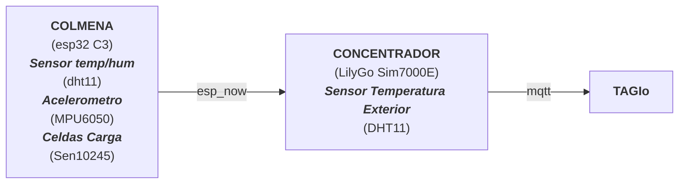
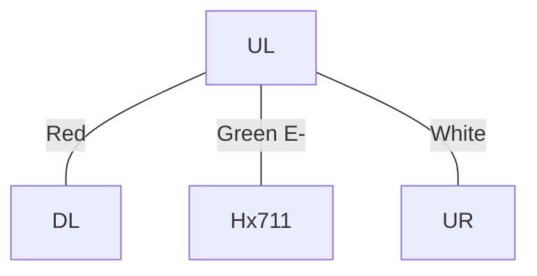
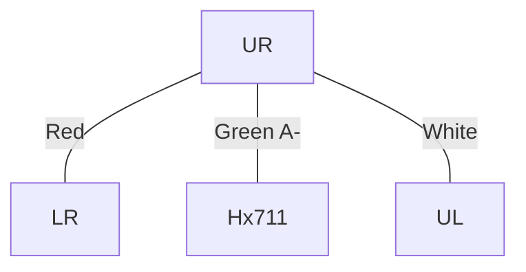
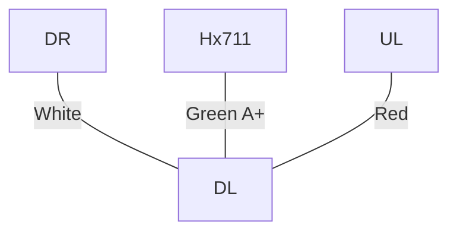
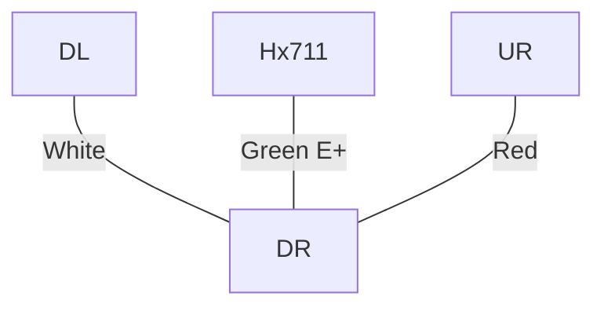
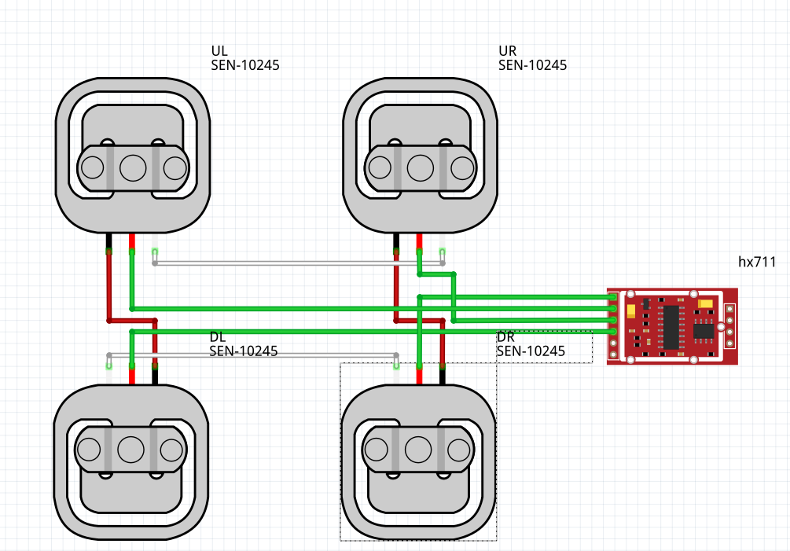
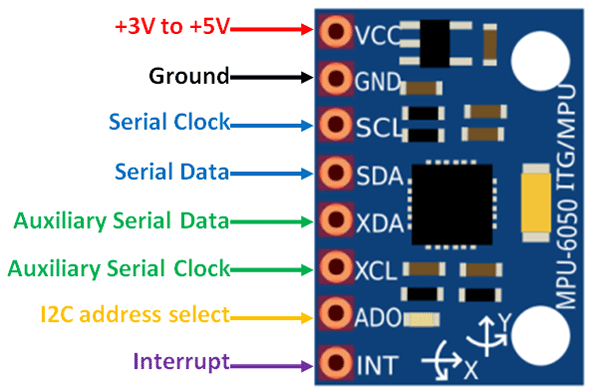

# PanBeeMon

* Monitorización de colmenas en remoto\
  Se mediran 7 parametros con sus correspondientes MQTT topics:
   * Temperatura interior\
      `/apiary{id}/hive{ID}/inTemp`
   * Humedad interior\
   `/apiary{id}/hive{ID}/inHum`
   * Inclinacion pitch\
   `/apiary{id}/hive{ID}/pitch`
   * Inclinacion yaw\
   `/apiary{id}/hive{ID}/yaw`
   * Inclinacion roll\
   `/apiary{id}/hive{ID}/roll`
   * Temperatura exterior\
   `/apiary{id}/hive{ID}/exTemp`
   * Peso\
   `/apiary{id}/hive{ID}/weight`

   
  

## Diagrama General
* **First Option**

* Second Option

## Diagramas y conexiones entre componentes
### Celdas de carga
* **UL** Up-Left

* **UR** Up-Right

* **DL** Down-Left

* **DR**Down-Right

* **Diagram**

* **Giroscopio**
  

